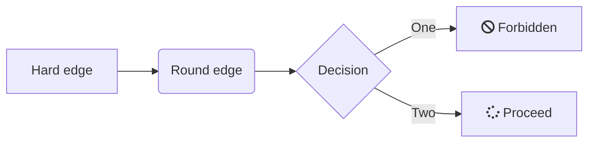
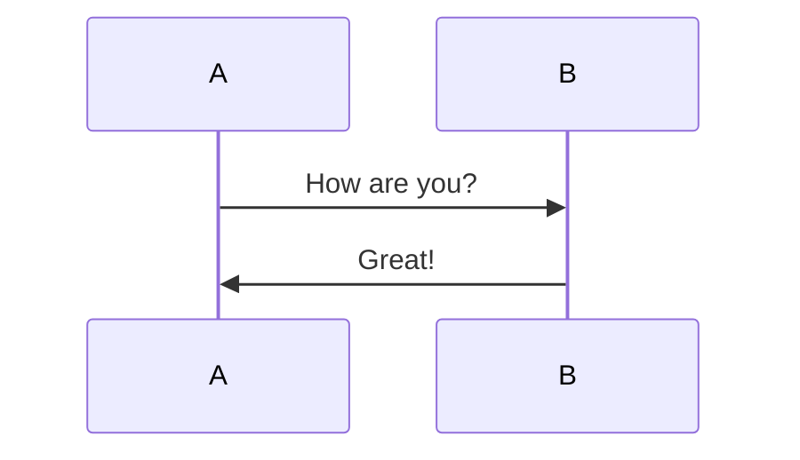
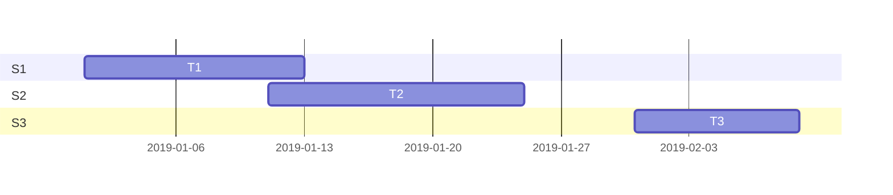

# My Markdown Demo

Hello, this is a markdown document. The key features include:

1. Open-source
2. Text-based syntax
3. Exports to PDF and HTML

> According to [Glen][1], this is a nice free, open-source program. Feel free to agree or disagree, but always provide evidence and cite your references for your claim.

[1]: https://www.coulthard.com/ "Coulthard.com"

## Section 1: Paragraphs

This is **the first content** that we'll be discussing. I have used a longer paragraph here in order to demonstrate word wrapping and how generated output will look in both HTML and PDF formats. The various notetaking programs will take different approaches to rendering and converting from markdown to PDF, but most will make use of [Pandoc](https://pandoc.org/).

## Section 2: Media

Markdown allows for the insertion of images and videos. However, the various *flavours* of markdown handle media differently, with only a few of them allowing **iframe embeds**. 

### Images


### Giphy&#46;com GIFs

<!---
The heading above uses &#46; instead of a
period to stop the automatic URL linking.
--->


### YouTube - Academic Writing in Markdown (746 x 420)

Direct link to [YouTube](https://www.youtube.com/watch?v=hpAJMSS8pvs) video.

<iframe width="746" height="420" src="https://www.youtube.com/embed/hpAJMSS8pvs" frameborder="0" allow="accelerometer; autoplay; encrypted-media; gyroscope; picture-in-picture" allowfullscreen></iframe>

### Techsmith Screencast iFrame (759 x 427)

Direct link to [Excel 01 - Lesson 01](https://www.screencast.com/t/YT9ULay2V24) video.

<iframe class="embeddedObject shadow resizable" name="embedded_content" scrolling="no" frameborder="0" type="text/html" 
        style="overflow:hidden;" src="https://www.screencast.com/users/GlenCoulthard/folders/Private/media/1f45458b-f986-4b74-9fa2-064d300abc16/embed" height="427" width="759" webkitallowfullscreen mozallowfullscreen allowfullscreen></iframe>

### Vimeo iFrame (768x432 Optimal)

Direct link to [Excel 01 - Lesson 01](https://vimeo.com/137637301) video.

<iframe src="https://player.vimeo.com/video/137637301" width="768" height="432" frameborder="0" allow="autoplay; fullscreen" allowfullscreen></iframe>

### TED Talk iFrame (853 x 480)

David McCandless on Data Visualization (896 x 504 is 2nd Optimal)

<iframe src="https://embed.ted.com/talks/david_mccandless_the_beauty_of_data_visualization" width="853" height="480" style="position:relative;left:0;top:0;width:853;height:480" frameborder="0" scrolling="no" allowfullscreen></iframe>

### Google Map Embed

This example was taken from http://embedgooglemap.net.

<div class="mapouter"><div class="gmap_canvas"><iframe width="600" height="500" id="gmap_canvas" src="https://maps.google.com/maps?q=7000%20College%20Way%2C%20Vernon%2C%20BC&t=&z=13&ie=UTF8&iwloc=&output=embed" frameborder="0" scrolling="no" marginheight="0" marginwidth="0"></iframe></div><style>.mapouter{position:relative;text-align:right;height:500px;width:600px;}.gmap_canvas {overflow:hidden;background:none!important;height:500px;width:600px;}</style></div>

### Twitter Feed iFrame

<iframe border=0 frameborder=0 height=568 width=600
 src="https://twitframe.com/show?url=https%3A%2F%2Ftwitter.com%2Fgcoulthard%2Fstatus%2F1248044370105749504%3Fref_src%3Dtwsrc%255Etfw"</iframe>

This iFrame uses [Twitframe](http://twitframe.com/) for embedding tweets. Note that you must use the URL-encoded form of the feed. This site is useful for doing this: [URL encoder/decoder](https://meyerweb.com/eric/tools/dencoder/)


### Quote of the Day iFrame

<a href="https://kwize.com/quote-of-the-day/"></a>

### Showing Web Page from BuadWiki (weatherwidget.io)

<iframe height="230" width="520" style="border:1px solid lightgray;" src="https://buadwiki.com/weather.html"></iframe>

### More iFrame Sites

For more, iFrame examples see: https://www.youtube.com/watch?v=g2p77ZCt6wM
- TwitFrame: https://twitframe.com/
- Obsidian Roadmap: https://trello.com/b/Psqfqp7I.html
- Google Maps (iframe): https://www.maps.ie/create-google-map/
- Virus tracker: https://ourworldindata.org/how-to-embed-charts
- Quote of the day widget: https://kwize.com/quote-widget/
- Weather Widget: https://weatherwidget.io/
- Stock widgets: https://www.tradingview.com/widget/
- HTML Generator: https://html-css-js.com/html/generator/iframe/

## Section 3: Code

Here is some bash script for you to review. Remember to use `sudo` for these commands.

```bash
# First, update your system
sudo apt update
sudo apt -y upgrade
# Now let's install some stuff
sudo apt install curl wget htop neofetch
```

Notice the HTML's syntax highlighting.

```html
<h1>Hello World</h1>
<p class="Tidy">This is an html paragraph and list.</p>
<ul>
    <li>One</li>
    <li>Two</li>
</ul>
<a href="http://www.coulthard.com">Coulthard.com</a>
```

## Section 4: Diagrams

*For some reason, the mermaid diagrams are not rendering.*

Now for a mermaid flowchart diagram with font-awesome icons.



How about a simple mermaid sequence diagram?



And, lastly, here is a mermaid gantt diagram.



## Section 5: Tables, Checklists, and Math

### Tables

Tables are straightforward and colons can be used to align columns.

| Tables   | Are           | Cool  |
| -------- |:-------------:| -----:|
| col 3 is | right-aligned | $1600 |
| col 2 is | centered      | $12   |
| col 1 is | left-aligned  | $1    |

### Check Lists

What do I need to do today? Well, let's prepare a task list.

- [ ] Go to the market
- [ ] Vacuum the floor
- [x] Buy more wine

### Math Equations

*Unfortunately, this is not working currently.*

**Some KaTeX/LaTeX ($) equations are supported.**

$f(x)$ 

$\sigma = \sqrt{ \frac{1}{N} \sum_{i=1}^N (x_i -\mu)^2}$

This equation is inline: $p={1\over q}$ 

>_See https://upmath.me for more LaTeX equations._ 

**You can also use AsciiMath/MathML blocks (\$$).**

$$
\sigma = \sqrt{ \frac{1}{N} \sum_{i=1}^N (x_i -\mu)^2}
$$

$$
x = {-b \pm \sqrt{b^2-4ac} \over 2a}
$$

## Section 6: Miscellaneous Features

### Icons, Footnotes, and Keyboard Buttons

Here are some basic emojis and a footnote[^1].  
:smile:  :beer:  :cat:  :dog: :santa: :heart:

How about a few keyboard graphics using `<kbd>`? <br />Note that the CSS formatting of buttons is off.
PRESS: <kbd>Ctrl</kbd>+<kbd>F9</kbd> to proceed  
PRESS: <kbd>Ctrl</kbd>+<kbd>Alt</kbd>+<kbd>Del</kbd> to reboot

[^1]: Emojis are small digital images, icons, or symbols used to express an idea or emotion. Here is the [complete list of github markdown emoji markup](https://gist.github.com/rxaviers/7360908).

### Definitions and Abbreviations/Acronyms

HTML
: Definition 1

CSS
: Definition 2a
: Definition 2b

<dl>
<dt>JavaScript</dt>
<dd>Definition 3</dd>
</dl>

*[HTML]: Hyper Text Markup Language 
*[CSS]: Cascading Style Sheet

### Admonitions and Alerts

*These do not work (yet?)*

### Using HTML Tags to Show/Hide Content

<!-- You can start the details section either "open" or "closed" -->
<details closed>
  <summary>Click here for the step-by-step answer</summary>
       <p>Presenting the solution:</p>
        <ul><li>First do *this*</li>
        <li>Then, do **this**</li></ul>
 </details>

